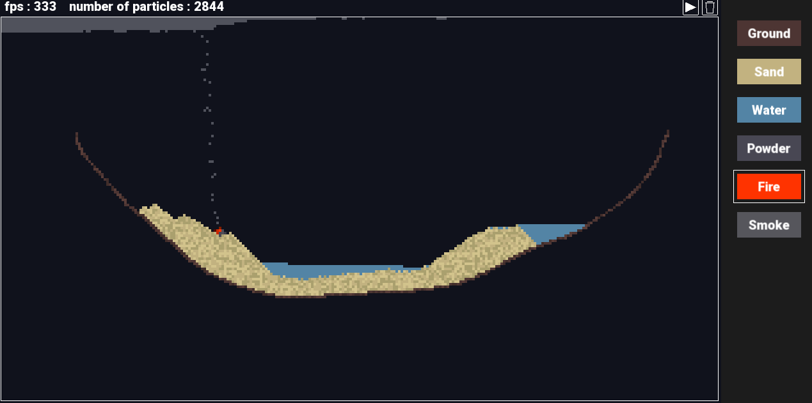

# Particles Simulator 1.0.0

A simple yet captivating 2D particles simulator made with SFML 3.0 using C++

## Screenshots




## Features

- Ground, sand, water, powder, fire, smoke
- Run/stop toggle
- Clear all particles

## Run

You can clone the repo and compile by yourself, or run ./bin/app exectuable file compiled with
```
g++ src/*.cpp -o bin/app -I include -L lib -lmingw32 -lsfml-graphics -lsfml-window -lsfml-system -O2 -Wall
```


## Controls

| Input            | Action
|------------------|------------------------
| Left Click       | Add particles  
| Right Click      | Remove particles  
| Mouse Wheel      | Change brush size

## Changelog

| Version | Date       | Changes
|---------|------------|----------------
| 1.0.0   | 03/08/2025 | Stable version